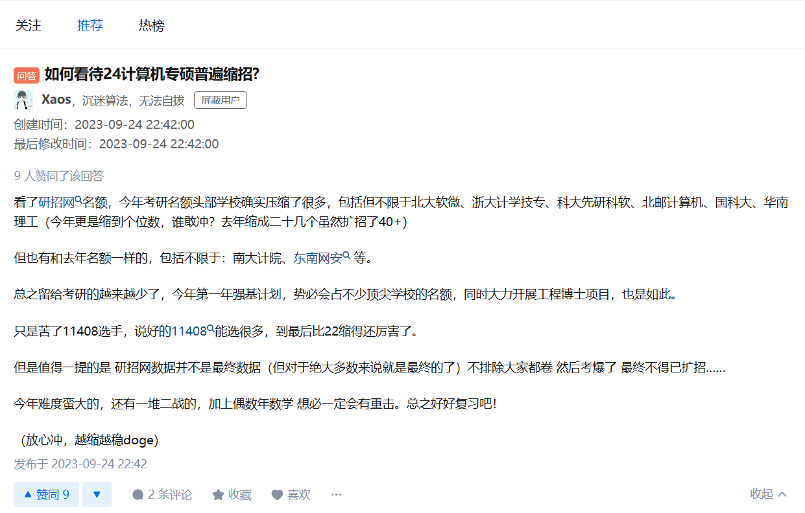
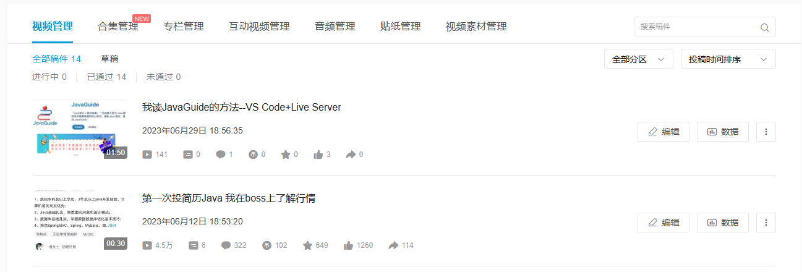

# 内容测试--图片测试


### 代码测试

```java
package com.song;

import java.time.LocalDateTime;
import java.time.format.DateTimeFormatter;
import java.util.Calendar;

public class Main {

    public static void main(String[] args) {
        // 冒泡排序示例
        // testBubbleSort();

        // 格式化时间输出系统当前时间示例
        //testTimeFormat();

        // 获取当前月份的最后一天
        getLastDayOfMonth();
    }

    // 在Java中，您可以使用Calendar类来判断当前月份的最后一天是几号。
    public static void getLastDayOfMonth() {
        Calendar calendar = Calendar.getInstance();
        int lastDayOfMonth;

        int year = calendar.get(Calendar.YEAR);
        int month = calendar.get(Calendar.MONTH);

        calendar.set(year, month + 1, 1); // 设置为下个月的第一天
        calendar.add(Calendar.DATE, -1); // 减去一天，即为当前月的最后一天

        lastDayOfMonth = calendar.get(Calendar.DATE);

        System.out.println("当前月份的最后一天是：" + lastDayOfMonth + "号");
    }

    public static void testTimeFormat() {
        // 输出结果示例：2023-12-21 17:55:05
        System.out.println(LocalDateTime.now().format(DateTimeFormatter.ofPattern("yyyy-MM-dd HH:mm:ss")));
    }

    /**
     * 测试冒泡排序
     */
    public static void testBubbleSort() {
        int[] arr = { 64, 34, 25, 12, 22, 11, 90, 5, 2 };
        System.out.println("排序前的数组：");
        printArray(arr);
        bubbleSort(arr);
        System.out.println("排序后的数组：");
        printArray(arr);
    }

    /**
     * 冒泡排序
     */
    public static void bubbleSort(int[] arr) {
        int n = arr.length;
        for (int i = 0; i < n - 1; i++) {
            for (int j = 0; j < n - i - 1; j++) {
                if (arr[j] > arr[j + 1]) {
                    // 交换arr[j]和arr[j + 1]
                    int temp = arr[j];
                    arr[j] = arr[j + 1];
                    arr[j + 1] = temp;
                }
            }
        }
    }

    // 打印整数类型的一维数组
    public static void printArray(int[] arr) {
        for (int i = 0; i < arr.length; i++) {
            System.out.print(arr[i] + " ");
        }
        System.out.println();
    }

}
```


### 图片测试

##### 情况1--使用img标签相对路径--全英文




##### 情况2--使用img标签相对路径--带中文


##### 情况3--使用md语法相对路径--全英文